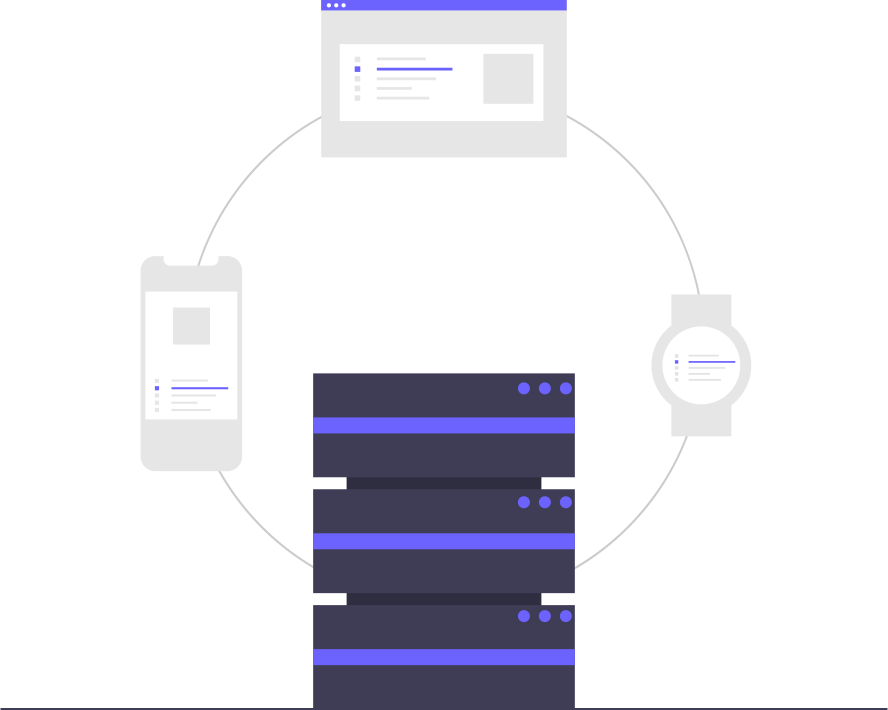


Learn how to use configure the `rerun-animation` package.


<!--  -->

The `rerun-viewer` calls the `rerun-loader-plugin` with a [pre-defined](https://rerun.io/docs/reference/data-loaders/overview) interface.
As of `rerun-sdk v0.18`, it is also not possible for the viewer to adjust some its visualization parameters, although this may [change](https://rerun.io/docs/reference/roadmap).

The `rerun-animation` package uses a global configuration file - `rerun-animation.ini` - to adapt the viewer and its loading behavior. 
Multiple variants are available and new ones can be installed and used.

All this is provided by the `rerun-animation-config {action}` interface.

## `rerun-animation-config` actions:

### _list_

This action prints all the available configurations.

```sh
rerun-animation-config list
[DATE TIME] INFO     7 configurations available:
                    INFO             100style
                    INFO             zeggs
                    INFO             trinity_speech_gesture
                    INFO             default
                    INFO             amass
                    INFO             motorica_dance
                    INFO             lafan1
```

<!-- <div id="termynal" data-termynal data-ty-lineDelay="700">
    <span data-ty="input">rerun-animation-config list</span>    
    <span data-ty>[DATE TIME] INFO     7 configurations available:</span>
    <span data-ty>amass</span>
    <span data-ty>lafan1</span>
    <span data-ty>zeggs</span>
    <span data-ty>default</span>
    <span data-ty>100style</span>
    <span data-ty>motorica_dance</span>
    <span data-ty>trinity_speech_gesture</span>    
</div> -->

Apart from the **default** configuration, `rerun-animation` comes with some pre-defined configurations for popular datasets.

### _print_

This action prints a specific, or the current (_when used with no arguments_), configuration.
<!-- 
```sh
rerun-animation-config print
{
│   'body': {
│   │   'type': 'smpl',
│   │   'pose_type': 'rotmat',
│   │   'use_pose_blendshapes': 'no',
│   │   'up_axis': 'y',
│   │   'show_rotations': 'no'
│   },
│   'smpl.file.keys': {
│   │   'shape': 'betas',
│   │   'pose': 'joint_rotation_matrices',
│   │   'gender': '',
│   │   'translation': 'root_position',
│   │   'rotation': '',
│   │   'fps': 'mocap_frame_rate',
│   │   'use_pose_blendshapes': 'no',
│   │   'up_axis': 'y',
│   │   'show_rotations': 'no'
│   },
│   'smpl.options': {
│   │   'use_pose_blendshapes': 'no',
│   │   'color': 'magenta',
│   │   'gender': '',
│   │   'pose_type': 'rotmat',
│   │   'up_axis': 'y',
│   │   'show_rotations': 'no'
│   },
│   'smplh.file.keys': {
│   │   'shape': 'betas',
│   │   'pose': 'pose_body',
│   │   'gender': 'gender',
│   │   'translation': 'trans',
│   │   'rotation': 'root_orient',
│   │   'hands': 'pose_hand',
│   │   'fps': 'mocap_frame_rate',
│   │   'use_pose_blendshapes': 'no',
│   │   'up_axis': 'y',
│   │   'show_rotations': 'no'
│   },
│   'smplh.options': {
│   │   'use_pose_blendshapes': 'yes',
│   │   'color': 'green',
│   │   'gender': '',
│   │   'pose_type': 'axisangle',
│   │   'up_axis': 'y',
│   │   'show_rotations': 'no'
│   },
│   'bvh.options': {
│   │   'show_rotations': 'no',
│   │   'joint_radius': '0.25',
│   │   'use_pose_blendshapes': 'no',
│   │   'up_axis': 'y'
│   },
│   'rerun': {
│   │   'up_axis': 'y',
│   │   'color': 'yellow',
│   │   'fps': '30',
│   │   'use_pose_blendshapes': 'no',
│   │   'show_rotations': 'no'
│   }
}
``` -->

```sh
rerun-animation-config print lafan1
{
│   'bvh.options': {
│   │   'show_rotations': 'no',
│   │   'joint_radius': '0.25'
│   },
│   'rerun': {
│   │   'up_axis': 'y',
│   │   'color': 'white',
│   │   'fps': '30'
│   }
}
```


The **current** configuration can be printed using `rerun-animation-config print`.


### _select_

This action selects one of the installed configurations.


```sh
rerun-animation-config select zeggs
INFO     🟢       Switched to the zeggs configuration.
```


The **installed** configurations can be printed using `rerun-animation-config list`.


### _reset_

This action resets the configuration to the default one.

```sh
rerun-animation-config reset
INFO     🟠       Switched back to the default configuration.
```


The **default** configuration can be printed using `rerun-animation-config print default`.


### _create_

This action creates a configuration file (`*.ini`) at the path it was called on for the user to customize.

```sh
rerun-animation-config create newconfig
INFO     A configuration file was created @ CURRENT/PATH/newconfig.ini. 
```


The newly created configuration uses the parameters from the **default** configuration.


### _install_

This action installs a local configuration file (`*.ini`).

```sh
rerun-animation-config install newconfig
INFO     ⚙       Installing configuration newconfig
INFO     🟢      Completed, the new (newconfig) configuration was installed and also selected as the current configuration.
```


The installed configuration will be available in the **list** and can be **printed** and/or **selected** for use on demand.


---