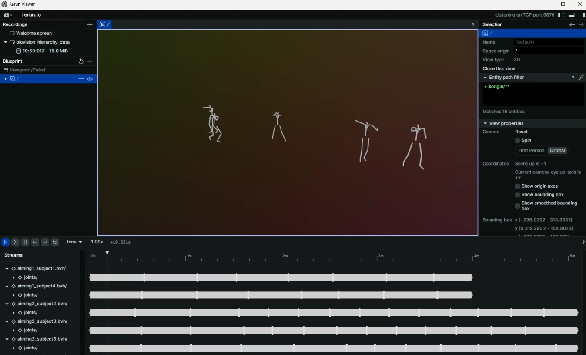


Learn how to use configure the `rerun-animation-stream` tool.


<!--  -->

# Streaming Animation Data

Apart from using the `rerun-viewer` as a `bvh/smpl-viewer`, the `rerun-animation` package offers a data streaming tool.

> This is helpful when one seeks to visualize lots of animations simultaneously, as the `rerun-loader-plugin` mechanism only allows for single file drops (as of `v0.18`).

1. Open a `rerun` viewer:
  ```sh
  rerun
  ```
2. Select the proper [configuration]():
  ```sh
  rerun-animation-config select lafan1
  INFO     🟢       Switched to the lafan1 configuration.
  ```
3. Stream a subset of LAFAN1 animations:
  ```sh
  rerun-animation-stream `PATH/TO/LAFAN1/aiming*_subject*.bvh`
  ```



---